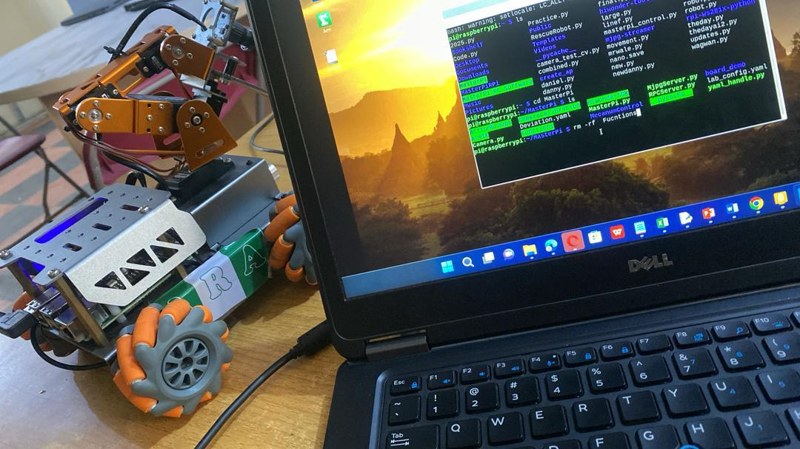

# Raspberry Pi Color Detecting Robot

**Demo Video:**  
[▶ Watch on YouTube](https://youtube.com/shorts/CE7qYdJ3vTQ?si=6YaLxQlvSn9ETpf-)

**Demo Image:**  


A Raspberry Pi–powered robot that detects and tracks colored objects in real time using Python and OpenCV.  
Designed with an SDK-style architecture.

---
**Features**

- Real-time color detection using HSV color space

- Raspberry Pi Camera and USB webcam support

- SDK-style modular Python architecture

- Live mode for real Raspberry Pi robot

- Adjustable color calibration

- Clean and extensible robotics codebase

- Open-source friendly project structure

---
**How It Works**

  Processing Pipeline

- Capture frame (camera / video / image)

- Convert frame from BGR → HSV

- Apply color threshold (mask)

## 🎥 Demo

**Demo Video:**  
[▶ Watch on YouTube](https://youtube.com/shorts/CE7qYdJ3vTQ?si=6YaLxQlvSn9ETpf-)

**Demo Image:**  


---
**🛠 Tech Stack**

- Language: Python 3

- Computer Vision: OpenCV

- Numerical Computing: NumPy

- Hardware Control: RPi.GPIO / gpiozero

- Platform: Raspberry Pi OS

- Testing: pytest

- CI/CD: GitHub Actions

## ⚡ Quickstart

```bash
# Clone the repository
git clone https://github.com/nexapytech/raspberry-pi-color-detecting-robot.git
cd raspberry-pi-color-detecting-robot

# (Optional) Create virtual environment
python3 -m venv venv
source venv/bin/activate

# Install dependencies
pip install -r requirements.txt

# Run in test mod
python src/main.py 
